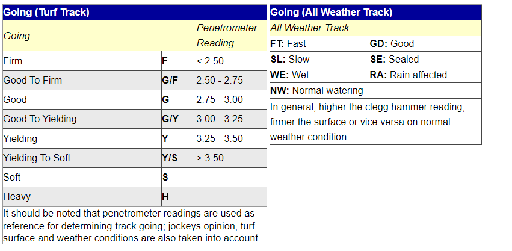

# Exploratory Data Analysis
In this section, we will be performing an exploratory data analysis of our horses and performances data sets. This analysis will include looking at univariate, bivariate, and multivariate summary statistics and visualizations of the data, analyzing the relationships between the features in our data sets, analyzing parsimonious models that can be developed with the data, and beginning to develop some of the foundational knowledge and early conjecture pertaining to next steps in developing more advanced classifiers and predictive models.

Reading in our data.
```{r}
horses <- read.csv("../../../data/01-modified-data/horses.clean.csv")
perf <- read.csv("../../../data/01-modified-data/perf.clean.csv")
```

```{r}
library(ggplot2)
library(dplyr)
```

## Horse Rating versus Race Placement
Let's first take a look at one of our biggest overarching questions: what attributes of a horse have the most impact on their outcome in a race. Due to the fact that the performance data set contains information on races of 25 DIFFERENT TRACK LENGTHS, and the length of a race is likely very much so NOT independent of a horse's attributes, the following data visualizations will be grouped by these race lengths. Because looking at 25 different track lengths on a singular visualization would be too messy to glean any information from, I decided to break the data into 3 distinct groups by creating a new variable in our data called "race_length". The groups will be races below 1600m (1 mile), races between 1600m and 2000m, and races over 2000m. 
```{r}
for(i in 1:nrow(perf)){
  
  if(perf$distance[i] < 1600){
    perf$race_length[i] <- "Less than 1600m"
  } else if(perf$distance[i] >= 1600 & perf$distance[i] <= 2000){
    perf$race_length[i] <- "1600m - 2000m"
  } else if(perf$distance[i] > 2000){
    perf$race_length[i] <- "More than 2000m"
  }
  
}
```

Let's take look at the distribution of horse race lengths.
```{r}
table(perf$race_length)
```
We can see that the majority of races were less than 1600m, followed relatively closely by races between 1600m and 2000m, and then lastly, races more than 2000m. The distribution of the data is fairly evenly distributed across race lengths, all things considered. We do not need to treat one of the race length groups as an outlier to the data.

Now we will start to build visualizations.
```{r}
g1<- ggplot(perf,aes(x=rating,y=final_placing))+geom_jitter()
g1
```
Upon the initial creation of this plot, we can see that we have some errors in our data where there are final placings of 47 and 99. We are going to delete these points. We also have anomalies where ratings are 333 and 951, which we will also remove.

```{r}
perf<- perf%>%
  filter(rating < 250 & final_placing != 47 & final_placing != 99)
```

Now we re-create our plot, along with cleaned formatting.
```{r}
# Re-ordering factor levels for legend
perf$race_length <- factor(perf$race_length, levels = c("More than 2000m", "1600m - 2000m", "Less than 1600m"))
g1<- ggplot(perf,aes(x=rating,y=final_placing,color=race_length))+
  geom_point()+
  ggtitle("Horse Rating vs. Final Race Placing")+
  xlab("Horse Rating")+
  ylab("Final Placing")+
  guides(color = guide_legend(title = "Race Length"))+
  scale_y_continuous(breaks=seq(1,14,by=1))
g1
```
As we can see above, there is a fairly even distribution of placements when we are looking at horse rankings for each race length. This plot helps us understand that historically, horses of all rankings have come in last place, first place, and everywhere in between. We can see, however, that there might be a small pattern happening towards the end of the x-axis: higher ranking horses look like they do not place low frequently and vice versa for lower ranked horses. In order to examine this potential pattern, lets only looking at horses with ranking 125 and up.

```{r}
perf.rating.filter <- perf %>%
  filter(rating >= 125)
g2<- ggplot(perf.rating.filter,aes(x=rating,y=final_placing,color=race_length))+
  geom_jitter()+
  ggtitle("Horse Rating vs. Final Race Placing")+
  xlab("Horse Rating")+
  ylab("Final Placing")+
  guides(color = guide_legend(title = "Race Length"))+
  scale_y_continuous(breaks=seq(1,14,by=1))
g2
```
Here, we are able to get a better gauge on how rating impacts final placement in a race. We can see that if a horse is above about a 135 rating, it becomes exceedingly rare for them to place below 10th. As we move on to a rating of 140, it becomes rare for the horse to place below 5th. These phenomena apply to races of all lengths (with races between 1600m and 2000m being the most common race). This knowledge becomes helpful when we eventually use horse rating to help determine the probability a horse has a podium finish (placement in the top 3).

Most horses, however, do not exceed ratings of 130 at the HJKC. Even still, the density of the data points is far higher at better placements for horses between 125 and 130. Horse rating certainly plays a role in determining if it wins (especially since rating is a metric derived from a horse's past performance and attributes).

## Starting Draw versus Final Race Placement
For every horse race, horses are given a starting position in the starting gates based on a random draw. There is often debate over what draw is best for a horse given the different lengths of races. I will be creating a plot to explore this debate and visualize how starting draw has affected final race placement among horses at HKJC.
```{r}
g3<- ggplot(perf.rating.filter,aes(x=draw,y=final_placing,color=race_length))+
  geom_count(aes(size = stat(prop)))+
  ggtitle("Starting Draw vs. Final Race Placing")+
  xlab("Draw")+
  ylab("Final Placing")+
  guides(color = guide_legend(title = "Race Length"))+
  scale_y_continuous(breaks=seq(1,14,by=1))+
  scale_x_continuous(breaks=seq(1,14,by=1))
g3
```
In the plot above, we can notice a couple things. For one, ALL winners (and even top 2 finishers) in races more than 2000m, started in gates 1 through 7, the inside lanes. This phenomena shows a clear advantage for the inside lanes in longer races. For races less than 1600m, this starting draw seems to not make as much of a difference, however the very outside lanes (lanes 10-14), do show less podium finishes than those horses in more inward lanes. These findings help inform the general relationship between draw and race placment, especially in terms of how we can expect to weight draw when we build models to predict a horse's racing performance over different track lengths.

## Summarry of Finshing Times for All Race Distances
In order to get an idea of how each race distance in the performance data set is distributed in terms of finishing time (in seconds), I have produced the table down below. This table will set the stage for interpreting the results in subsequent plots.s
```{r}
# Removing observations where finish time = 0
perf.no.zero <- perf %>%
  filter(finish_time != 0)
tapply(perf.no.zero$finish_time, perf.no.zero$distance, summary)
```

## The Effect of the Type of Track (Turf vs Dirt) on Finishing Time
Another topic of interest is how the type of track, turf versus dirt (labeled as All Weather Track, aka AWT, in the data), might effect the finishing times of times of horses. The Sha Tin Racecourse contains both dirt and turf tracks, while Happy Valley only contains turf tracks. Analyzing track differences could more optimally predict horse performance for each respective racing grounds. We will take a look at this question in the box plots below.
```{r}
g4 <- ggplot(perf.no.zero,aes(x=track,y=finish_time,color=as.factor(distance)))+
  geom_boxplot()+
  ggtitle("Type of Track vs. Finishing Time")+
  xlab("Type of Track")+
  ylab("Finishing Time (s)")+
  guides(color = guide_legend(title = "Race Length (m)"))
g4
```
Upon first glance, we can see that any race on an AWT track was wither 1200m, 1650m, or 1800m, while races of all distances (where a finishing time was recorded) happened on turf tracks. There does not appear to be any significant difference in median finishing times for the 1200, 1650, and 1800 meter races on AWT tracks versus Turf tracks, which is actually quite suprising. The spread of times on turf tracks, however, does appear to be higher.

One can only wonder how the conditions of the tracks might effect finishing time, especially with the influences of weather, seasonality, and how many races the track has already seen before a race. To analyze the effect of track condition, along with the type of track, a grid of plots can be found below.

```{r}
g5 <- ggplot(perf.no.zero,aes(x=track,y=finish_time,color=race_length))+
  geom_violin()+
  ggtitle("Type of Track and Track Condition vs. Finishing Time")+
  xlab("Type of Track")+
  ylab("Finishing Time (s)")+
  facet_wrap(vars(going))+
  guides(color = guide_legend(title = "Race Length (m)"))
g5
```
As a reminder, the meanings behind each acronym for 'going' can be found below (note that WF means Wet Fast and WS means Wet Slow):

While it may look like there is a lot going on in the above plot, overall, it does not appear that there are any significant differences in median finishing times when turf and AWT tracks have any different going ratings. This finding is VERY suprising. This observation is not to say that track going has NO impact on finishing time, but these differences might be very marginal and require more detailed hypothesis testing and analysis to make further inference. It SHOULD be noted, however, that when an AWT track is rated as fast, good, slow, or wet, there seems to be very little spread in finishing times. In other words, there is far less variability in how fast all the horses run (races might be closer in nature).

# The Effect of Horse Weight on Race Performance

```{r}
library(ggpubr)
g6 <- ggplot(perf.no.zero,aes(x=on_date_weight,y=finish_time))+
  geom_point()+
  ggtitle("Horse Weight vs. Finishing Time")+
  xlab("Horse Weight (lbs)")+
  ylab("Finishing Time (s)")+
  facet_wrap(vars(distance))+
  stat_cor(method="pearson",label.x = 200, label.y = 30)
  
g6
```
The results from this plot are probably the most suprising out of any of the EDA results thus far. While the significance of a Horse's weight is a popular topic of debate among horse racing handicappers, it is a common trope that the heavier horse usually wins. This trope is actually a phenomena I thought this data visualization would display, but clearly, no such phenomena is evident. In fact, all of our correlation coefficients are negative. It should be said that these correlation coefficients all convey very weak relationships. All of our coefficients, except for races above 2000m, are statistically significant, too.

With this finding, let's look if added weight to a horse (i.e. jockey weight, gear, etc.) has any signifcant effect on finish time.
```{r}
g7 <- ggplot(perf.no.zero,aes(x=actual_weight,y=finish_time))+
  geom_point()+
  ggtitle("Horse Weight vs. Finishing Time")+
  xlab("Added Weight (lbs)")+
  ylab("Finishing Time (s)")+
  facet_wrap(vars(distance))+
  stat_cor(method="pearson",label.x = 100, label.y = 30)
  
g7
```
The same findings hold true for added weight to the horse as the weight of the horse itself. Added weight is very weakly correlated with finishing time across all race distances. Again, this result is very surprising. 

## The Effect of Horse Sex and Import Type on Podium Finishes
```{r}
horses$podium <- horses$first_place + horses$second_place + horses$third_place
```

```{r}
g8 <- ggplot(horses,aes(x=import_type,y=podium,color=sex))+
  geom_bar(stat = 'identity')+
  ggtitle("Horse Import Type and Sex vs. Number of Podium Finishes")+
  xlab("Import Type")+
  ylab("Podium Finishes")
g8
```
I will tidy this up and add explanation later on.

Note for grader: I will likely add a plot later that explores the relationship of finishing times/placement versus the specific courses that are being run at Happy Valley and Sha Tin (especially if I decide to incorporate such in any model I create). Also, it would be cool to eventually add some kind of visualization of each race course that displays average time it takes horses to complete each stretch.
